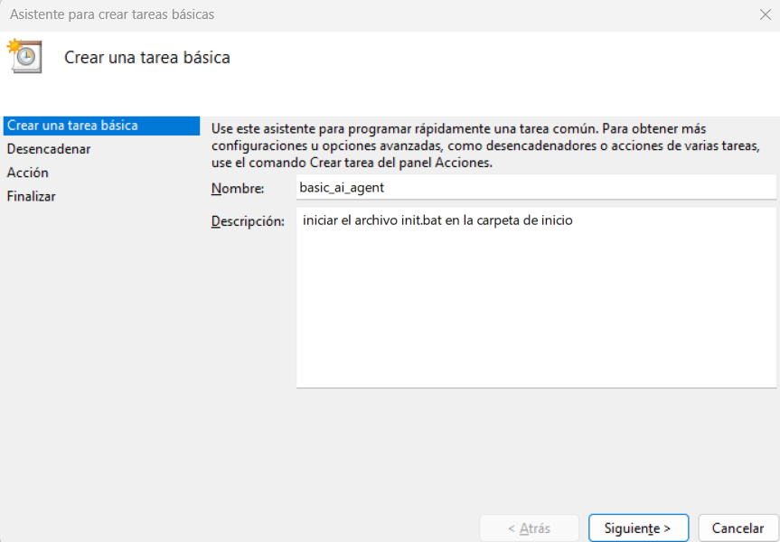
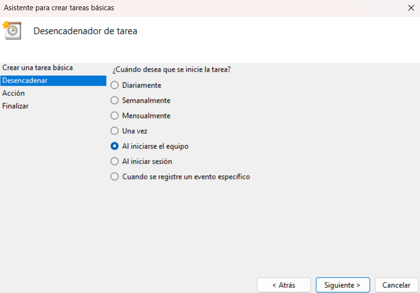
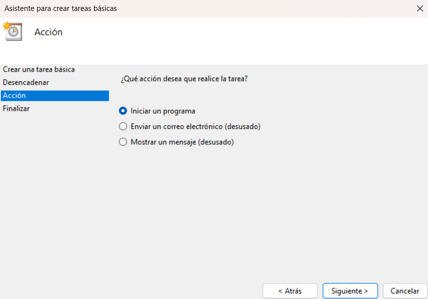
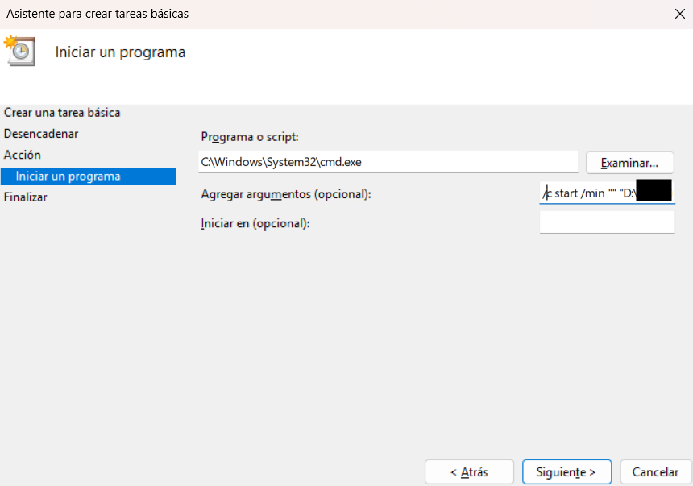
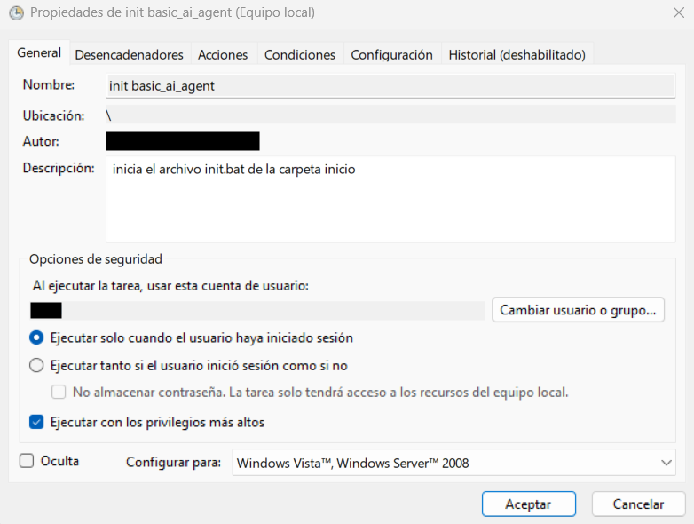
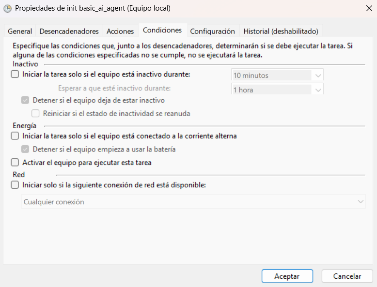
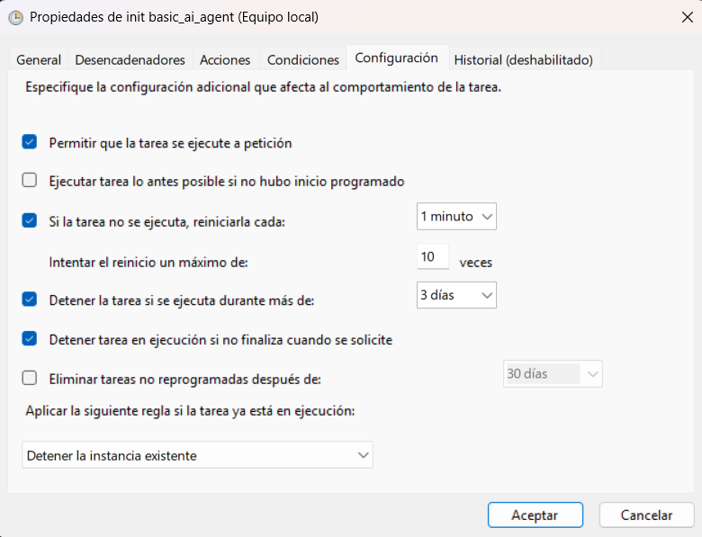

# Pasos para iniciación automática del agente IA en Windows:

## 1º - Iniciar 'Programador de tareas' y seleccionar 'Crear tarea básica', rellenar los siguientes datos:

  
  

  
  

### En 'Agregar argumentos' indicar (rellenando los datos de la ruta):

    /c start /min "" "D:\Ruta_completa_a_init.bat\init.bat"

## 2º Finalizar, seleccionar la tarea, ir a 'Propiedades' y marcar lo siguiente:

  
  
  

## 3º Aceptar y reiniciar el PC.

Se iniciará un terminal iniciando init.bat, y una pestaña del navegador predeterminado con el agente IA tras unos segundos de cargar el modelo.
